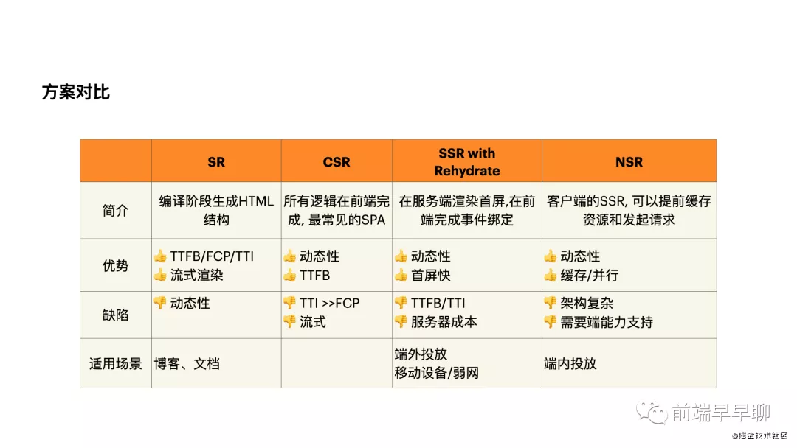

# 性能优化

## 性能监控 && 性能优化

性能指标：

- FP（首次绘制）
- FCP（首次内容绘制 First contentful paint）
- LCP（最大内容绘制时间 Largest contentful paint）
- FPS（每秒传输帧数）
- TTI（页面可交互时间 Time to Interactive）
- HTTP 请求响应时间
- DNS 解析时间
- TCP 连接时间性能数据采集需要使用 window.performance API ， JS 库 web-vitals：import {getLCP} from 'web-vitals';

```javascript
// 重定向耗时
const redirect = timing.redirectEnd - timing.redirectStart;
// DOM 渲染耗时
const dom = timing.domComplete - timing.domLoading;
// 页面加载耗时
const load = timing.loadEventEnd - timing.navigationStart;
// 页面卸载耗时
const unload = timing.unloadEventEnd - timing.unloadEventStart;
// 请求耗时
const request = timing.responseEnd - timing.requestStart;
// 获取性能信息时当前时间
const time = new Date().getTime();
// DNS查询耗时
const domain = domainLookupEnd - domainLookupStart;
// TCP链接耗时
const connect = connectEnd - connectStart;
// request请求耗时
const request = responseEnd - responseStart;
// 解析dom树耗时
const domParse = domComplete - domInteractive;
// 白屏时间
const whireScreen = domloadng - fetchStart;
// onload时间
const loadEvent = loadEventEnd - fetchStart;
```

## 性能优化常用手段：缓存技术、 预加载技术、 渲染方案。

1. 缓存 ：主要有 cdn、浏览器缓存、本地缓存以及应用离线包

2. 预加载 ：资源预拉取（prefetch）则是另一种性能优化的技术。通过预拉取可以告诉浏览器用户在未来可能用到哪些资源。

- prefetch 支持预拉取图片、脚本或者任何可以被浏览器缓存的资源。

  在 head 里 添加 <linkrel="prefetch"href="image.png">

- prerender 是一个重量级的选项，它可以让浏览器提前加载指定页面的所有资源。

- subresource 可以用来指定资源是最高优先级的。当前页面需要，或者马上就会用到时。

3. 渲染方案：

- 静态渲染（SR）
- 前端渲染（CSR）
- 服务端渲染（SSR）
- 客户端渲染（NSR）：NSR 数据请求，首屏数据请求和数据线上与 webview 的一个初始化和框架 JS 初始化并行了起来，大大缩短了首屏时间。

  
