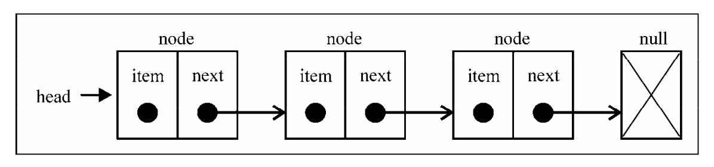

# 链表

链表存储有序的元素集合，但不同于数组，链表中的元素在内存中并不是连续放置的。

每个元素由一个存储元素本身的节点和一个指向下一个元素的引用（也称指针或链接）组成。



相对于传统的数组，链表的一个好处在于，添加或移除元素的时候不需要移动其他元素。

然而，链表需要使用指针，因此实现链表时需要额外注意。

数组的另一个细节是可以直接访问任何位置的任何元素，而要想访问链表中间的一个元素，

需要从起点（表头）开始迭代列表直到找到所需的元素。

---

## 创建一个链表

以下是我们的 `LinkedList` 类的骨架：

```javascript
function LinkedList() {
  var Node = function (element) {
    // {1}
    this.element = element;
    this.next = null;
  };
  var length = 0; // {2}
  var head = null; // {3}

  this.append = function (element) {};
  this.insert = function (position, element) {};
  this.removeAt = function (position) {};
  this.remove = function (element) {};
  this.indexOf = function (element) {};
  this.isEmpty = function () {};
  this.size = function () {};
  this.toString = function () {};
  this.print = function () {};
}
```

<br>

> 1. `LinkedList` 数据结构还需要一个 `Node` 辅助类。`Node` 类表示要加入列表的项。它包含一个 `element` 属性，即要添加到列表的值，以及一个 `next` 属性，即指向列表中下一个节点项的指针
> 2. `LinkedList` 类也有存储列表项的数量的 `length` 属性
> 3. 我们还需要存储第一个节点的引用, 可以把这个引用存储在一个称为`head`的变量中。

<br>

`LinkedList` 方法以及对应的职责：

- append(element)：向列表尾部添加一个新的项。

- insert(position, element)：向列表的特定位置插入一个新的项。

- remove(element)：从列表中移除一项。

- indexOf(element)：返回元素在列表中的索引。如果列表中没有该元素则返回-1。

- removeAt(position)：从列表的特定位置移除一项。

- isEmpty()：如果链表中不包含任何元素，返回 true，如果链表长度大于 0 则返回 false。

- size()：返回链表包含的元素个数。与数组的 length 属性类似。

- toString()：由于列表项使用了 Node 类，就需要重写继承自 JavaScript 对象默认的 toString 方法，让其只输出元素的值。

<br>

1. 向链表尾部追加元素

有两种场景：列表为空，添加的是第一个元素，或者列表不为空，向其追加元素。

```javascript
this.append = function (element) {
  let node = new Node(element),
    current;

  /**
   * 当链表为空时
   * head 是我们在前文中提到过，用于存储第一个节点的引用
   */
  if (head === null) {
    head = node;
  } else {
    current = head;

    while (current.next) {
      current = current.next;
    }

    current.next = node;
  }

  length++;
};
```

<br>

2. 从链表中移除元素

移除元素也有两种场景：

- 第一种是移除第一个元素，

- 第二种是移除第一个以外的任一元素。

我们要实现两种 remove 方法

- 第一种是从特定位置移除一个元素

- 第二种是根据元素的值移除元素（稍后我们会展示第二种 remove 方法）。

---

## 双向链表

## 循环链表
